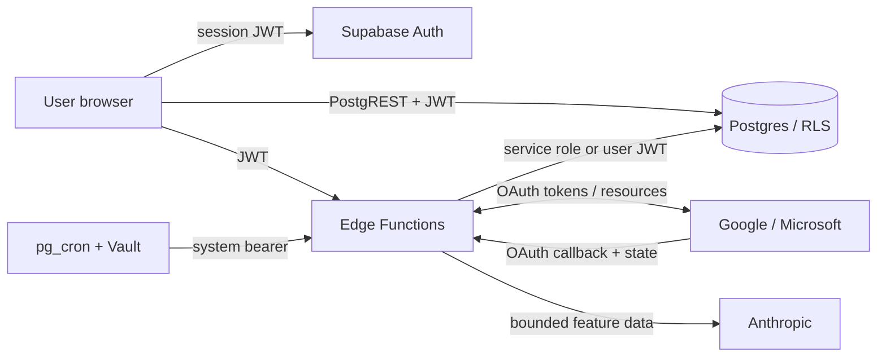

# Monotask Threat Model

## Overview

Monotask is a React/Vite browser productivity application backed by Supabase
Auth, Postgres with row-level security, and Deno Edge Functions. It synchronizes
calendar and task data with Google and Microsoft and sends selected user data to
Anthropic for task parsing, message-derived suggestions, weekly summaries, and
calendar-conflict suggestions.

This model describes repository evidence. Production dashboards, deployed
secrets, provider configuration, and live database grants remain separate
verification items. Secret values and `.env` contents are deliberately excluded.

| Component | Authority and data | Evidence |
|---|---|---|
| React browser | Public Supabase configuration plus the current user's session | `src/integrations/supabase/client.ts:4-14` |
| Postgres/RLS | Per-user tasks, events, habits, tags, logs, settings, integration metadata, AI usage, and suggestions | `supabase/migrations/20250624010200_a47821d5-86d6-4c83-8faf-d23249a65a87.sql:79-120` |
| Edge Functions | User-authenticated operations and privileged service-role workflows | `supabase/config.toml:12-50` |
| OAuth integration | Google/Microsoft authorization, token refresh, provider reads, and provider mutations | `supabase/functions/_shared/integrations/google.ts:88-125`, `supabase/functions/_shared/integrations/microsoft.ts:165-205` |
| Scheduled jobs | Vault-referenced service-role bearer invokes sync and AI jobs every ten minutes | `supabase/migrations/20260910120200_schedule-sync-integrations.sql:11-23`, `supabase/migrations/20260914140000_schedule-ai-subsystem.sql:6-37` |
| Anthropic | Receives task text, aggregate statistics, message snippets/metadata, or event titles/times depending on feature | `supabase/functions/parse-task/index.ts:137-147`, `supabase/functions/scan-messages/index.ts:151-178` |

## Assets and security objectives

- User identity, sessions, tasks, habits, logs, goals, tags, settings, calendar
  events, provider account metadata, and AI suggestions must remain tenant-isolated.
- Google/Microsoft access and refresh tokens, provider client secrets, the
  Supabase service-role key, Vault secret references, and the Anthropic key must
  remain server-side and absent from logs, reports, browser responses, and model
  inputs.
- Service-role operations must authenticate their caller before bypassing RLS.
- OAuth callbacks must bind tokens only to the user, provider, and connection
  represented by a random, single-use, short-lived state.
- Provider mutations must be limited to resources reached through the
  authenticated user's verified connection.
- Message scanning remains opt-in and stores derived suggestions rather than raw
  message bodies.
- AI inputs are minimized and bounded; outputs are treated as untrusted,
  schema/semantically validated, and advisory.
- Rate limits protect per-user availability and shared model spend.

## Trust boundaries and attacker capabilities

### Unauthenticated internet caller

Can call public Edge Function URLs with chosen methods, bodies, and headers and
can reach the OAuth callback. Does not initially possess a Monotask JWT, OAuth
state, provider token, service-role key, Vault access, or Anthropic key.

Expected control: platform JWT validation or explicit in-function authentication.
The OAuth callback is the exception and relies on the state record.

### Authenticated user

Can control their own application data, call browser-facing functions, supply
connection and external-resource identifiers, and initiate OAuth flows. Does not
initially possess another user's session, integration connection, provider token,
or service-role authority.

Expected controls: `auth.getUser()`, RLS, ownership predicates before every
service-role access, bounded input, and provider-resource binding.

### External message or calendar participant

Can influence content later ingested from Google or Microsoft. This content is
untrusted prompt input and must not become instructions or authority.

Expected controls: data/instruction separation, input bounds, schema validation,
semantic validation, and user approval before mutations.

### Scheduler and privileged infrastructure

`pg_cron` reads a service-role credential reference from Vault and invokes
system-wide jobs. Compromise of this authority is outside the ordinary attacker
starting point and would bypass RLS across the project.

Expected controls: exact bearer validation (preferably a dedicated scheduler
secret), least-privilege secret access, isolated job environment, concurrency
control, and sanitized logging.

## Prioritized attacker stories

These are review scenarios. A scenario becomes a finding only after independent
source validation.

| Priority | Scenario and capability gain | Existing control | Required mitigation/evidence |
|---|---|---|---|
| P0 | Anonymous caller triggers system-wide message or conflict processing with service-role authority | Cron sends a bearer, per-user AI quotas | Functions must verify the caller before privileged work; add negative tests and concurrency control |
| P0 | Authenticated user crosses RLS or supplies another tenant's identifier to a service-role function | RLS and several explicit `user_id` filters | Two-user tests for every table/function and source tracing of every service-role query |
| P1 | Leaked, abandoned OAuth state remains usable or is raced/replayed | Random UUID and delete-before-exchange | Atomic consume with a short TTL; expired/replay/concurrency tests |
| P1 | Public `SECURITY DEFINER` function accepts a caller-selected tenant | `search_path` is fixed; callers normally omit `p_user_id` | Explicit grants and separate user/system signatures; live-grant verification |
| P1 | OAuth token or provider data leaks through views, logs, errors, analytics, or browser responses | Token-free view and generic top-level errors | Live-schema grants, log review, and response tests |
| P1 | Malicious messages/events manipulate AI behavior or persisted suggestions | Structured output and application validation | Prompt-injection corpus, strict size/field bounds, and no ambient tool authority |
| P1 | Repeated requests exhaust provider/model quotas or race watermarks | Daily AI counters | Authenticated scheduler, request/method limits, timeouts, locking/idempotency, monitoring |
| P2 | Malicious persisted data executes in the browser | React escaping; chart style helper reviewed | Trace all HTML/URL/style sinks and add focused rendering tests where attacker input reaches them |

## Effective configuration and open assumptions

| Workflow | Effective repository value or reference | Control or unresolved question |
|---|---|---|
| Supabase Auth redirects | Localhost URLs in `supabase/config.toml:8-10` | Production dashboard/config must be verified separately |
| OAuth callback URL | `OAUTH_CALLBACK_URL`, else derived from `SUPABASE_URL` | Provider allowlists and deployed value are not proven by source |
| Post-OAuth app redirect | `APP_ORIGIN`, else Edge Function origin | Production must set an exact HTTPS application origin |
| Integration token exposure | Base table restricted; browser view omits token columns and filters `auth.uid()` | Confirm effective deployed view mode, owner, and grants |
| Scheduled authorization | Vault `service_role_key` reference placed in `Authorization` | Each endpoint must actually validate it; dedicated cron secret is preferable |
| AI quota RPC | `SECURITY DEFINER`, optional `p_user_id` | Effective execute grants require source remediation and live verification |
| Anthropic retention/privacy | Server key reference and feature-specific payloads | Contract, retention setting, region, deletion, and privacy disclosure require owner verification |

**Resolved** (`supabase/migrations/20260923120000_fix-cron-hardcoded-project-url.sql`):
cron job URLs are now resolved from a `functions_base_url` Vault secret at
call time, the same way `service_role_key` already was, instead of being a
literal string in the migration. Applying these migrations to another
Supabase project now requires that project's own operator to set both
secrets for its own URL/key - no cross-project credential forwarding by
default. The two original migrations still contain the historical
hard-coded URL in their own file (migrations are append-only), but the
`cron.schedule` job names are identical, so the newer migration replaces
their effective schedule.

## Severity calibration

- **Critical:** source-backed path to immediate broad secret compromise,
  arbitrary privileged code execution, or unrestricted cross-tenant data
  compromise with no material prerequisite.
- **High:** realistic unauthenticated or low-privilege path to system-wide
  privileged processing, sensitive cross-tenant access, provider mutation, or
  substantial integrity/availability impact. Validated High issues block launch.
- **Medium:** meaningful tenant, OAuth, privacy, or availability failure that
  needs a leaked nonce, known user identifier, configuration prerequisite, or
  otherwise constrained reachability.
- **Low:** limited-impact hardening issue with realistic reachability but no
  sensitive boundary crossing. Pure best practice without a plausible attacker
  or impact is recorded as hardening, not a vulnerability.

